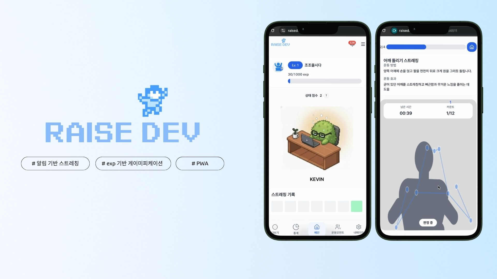

# Growing Developer

하루종일 앉아있어 건강에 위협을 받는 개발자가 바쁜 일상 속에서도 건강한 스트레칭 습관을 만들 수 있도록 돕는 PWA 기반 웹 서비스입니다.  
온보딩 설문을 기반으로 맞춤 스트레칭을 제안하고, 알림, 세션 기록과 리포트를 제공합니다.

## 목차

1. [서비스 소개](#1-서비스-소개)
2. [팀원 소개](#2-팀원-소개)
3. [FE 기술 스택](#3-fe-기술-스택)
4. [FE 개발 컨벤션](#4-fe-개발-컨벤션)

## 1. 서비스 소개

### 서비스 한 줄 소개

`Growing Developer`는 개발자의 건강한 루틴 형성을 돕기 위해, 맞춤 스트레칭 추천부터 알림, 수행, 기록까지 연결하는 서비스입니다.

### 해결하려는 문제

- 개발자는 장시간 앉아서 일하는 환경 때문에 목, 어깨, 눈의 피로가 쉽게 누적됩니다.
- 스트레칭이 필요하다는 것을 알아도, 언제 무엇을 해야 할지 몰라 실천이 어렵습니다.
- 건강 관리를 꾸준한 습관으로 만들기 위해서는 추천, 리마인드, 동기부여가 하나의 경험으로 이어져야 합니다.

### 핵심 기능

- 온보딩 설문을 통해 사용자 상태를 파악하고 맞춤 스트레칭 플랜을 생성합니다.
- 알림 설정과 푸시 권한 흐름을 제공해 스트레칭 루틴을 지속하도록 돕습니다.
- 웹 환경에서도 앱처럼 사용할 수 있도록 PWA 설치 가이드를 제공합니다.
- 스트레칭 세션 진행, 결과 확인, 리포트와 통계를 통해 사용자 변화와 성취를 보여줍니다.
- 캐릭터, 상태 점수, 퀘스트 등 게임화 요소로 지속적인 참여를 유도합니다.

## 2. 팀원 소개

## 👥 Team Members

<table>
  <tr>
    <td align="center"><b>한경준</b></td>
    <td align="center"><b>박지은</b></td>
    <td align="center"><b>김연우</b></td>
    <td align="center"><b>임준혁</b></td>
    <td align="center"><b>김종민</b></td>
  </tr>
  <tr>
    <td align="center">
      
    </td>
    <td align="center">
      
    </td>
    <td align="center">
      
    </td>
    <td align="center">
      
    </td>
        <td align="center">
      
    </td>
  </tr>
  <tr>
    <td align="center">
      <a href="https://github.com/hkjbrian">@hkjbrian</a>
    </td>
    <td align="center">
      <a href="https://github.com/jieun0824">@jieun0824</a>
    </td>
    <td align="center">
      <a href="https://github.com/yanwoo8">@yanwoo8</a>
    </td>
    <td align="center">
      <a href="https://github.com/Burnt-Waffle">@Burnt-Waffle</a>
    </td>
        <td align="center">
      <a href="https://github.com/jmKim02">@jmKim02</a>
    </td>
  </tr>
</table>

## 3. FE 기술 스택

| 구분                 | 기술                                          |
| -------------------- | --------------------------------------------- |
| Framework            | `Next.js 16` (`Pages Router`)                 |
| UI Library           | `React 19`                                    |
| Language             | `TypeScript 5`                                |
| Styling              | `Tailwind CSS v4`                             |
| State / Server State | `TanStack Query v5`, `Zustand`                |
| Form / Validation    | `React Hook Form`, `Zod`                      |
| Monorepo             | `Turborepo`, `pnpm workspace`                 |
| UI Package           | `@repo/ui`, `@repo/tokens`                    |
| Testing              | `Jest`, `React Testing Library`, `user-event` |
| Quality              | `ESLint`, `Prettier`, `husky`, `lint-staged`  |
| Monitoring / Infra   | `Sentry`, `Firebase`, `Redis`                 |

### FE 아키텍처

- `FSD(Feature-Sliced Design)` 기반으로 레이어 책임을 분리합니다.
- `apps/web`와 `packages/*`를 나눈 모노레포 구조를 사용합니다.
- 공통 UI와 토큰은 패키지로 분리해 재사용성과 일관성을 높입니다.

## 4. FE 개발 컨벤션

### 1) 라우팅과 화면 구조

- Next.js는 `Pages Router`를 사용합니다.
- `pages/**`는 라우팅 전용으로 사용하고, 실제 화면 로직은 `src/pages/**`에 둡니다.

### 2) FSD 레이어 규칙

- 레이어는 `shared -> entities -> features -> widgets -> pages` 방향으로만 의존합니다.
- 하위 레이어가 상위 레이어를 import 하는 역방향 의존은 금지합니다.
- 공용으로 노출할 항목은 슬라이스 단위 `index.ts`에서 명시적으로 export 합니다.

### 3) 네이밍 컨벤션

아래 문서를 참고하도록 한다.

[네이밍 컨벤션 문서](https://github.com/100-hours-a-week/1-team-one-fe/wiki/%EB%84%A4%EC%9D%B4%EB%B0%8D-%EC%BB%A8%EB%B2%A4%EC%85%98)

### 4) 공통 에러 컨벤션 팀 규칙

[공통 에러 처리 정리](https://github.com/100-hours-a-week/1-team-one-fe/wiki/260130-%EA%B3%B5%ED%86%B5-%EC%97%90%EB%9F%AC-%EC%B2%98%EB%A6%AC-%EC%A0%95%EB%A6%AC)

### 5) 공통 로딩 컨벤션 팀 규칙

페이지 추가 혹은 새로운 컴포넌트 추가로 로딩 상태 정의가 필요하다면, 아래 문서를 참고하도록 한다.

-> [페이지 추가 시 참고해야 할 로딩 컨벤션](https://github.com/100-hours-a-week/1-team-one-fe/wiki/260203-%EA%B3%B5%ED%86%B5-%EB%A1%9C%EB%94%A9-%EC%84%A4%EC%A0%95-%EC%B6%94%EA%B0%80---%ED%8C%80-%EC%BB%A8%EB%B2%A4%EC%85%98-%EC%A0%95%EC%9D%98)

공통 로딩 구현 지점에 대한 변경 혹은 이해가 필요하다면, 아래 문서를 참고하도록 한다.

-> [공통 로딩 구현 상세](https://github.com/100-hours-a-week/1-team-one-fe/wiki/260202-%EA%B3%B5%ED%86%B5-%EB%A1%9C%EB%94%A9-%EC%84%A4%EC%A0%95-%EC%B6%94%EA%B0%80)
